# Introduccion a Rails

En esta seccion creamos una app sencilla de Rails, y aprovechamos los generadores de Rails para ahorrar trabajo. Utilizando **generate scaffold** Rails genera casi todo lo que necesitamos: Una migracion inicial, un modelo **todo**, un controlador para **todo**, las vistas para las operaciones CRUD, asi como metodos helper, para pruebas unitarias, etc.

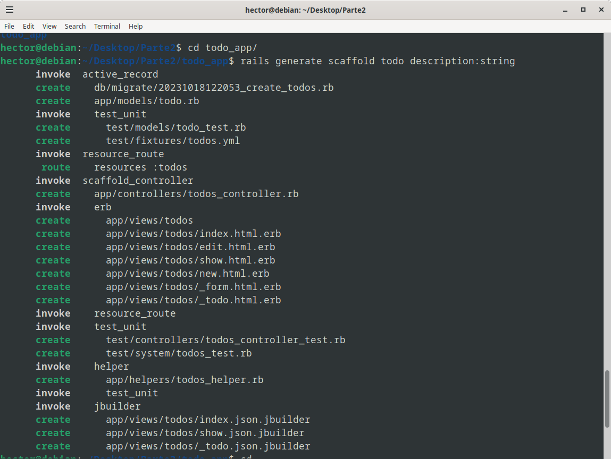

Al incluir **description:string** en el comando de generacion del scaffold ya estamos definiendo el esquema de nuestra base de datos. Solo nos falta realizar la migracion para crear una tabla.

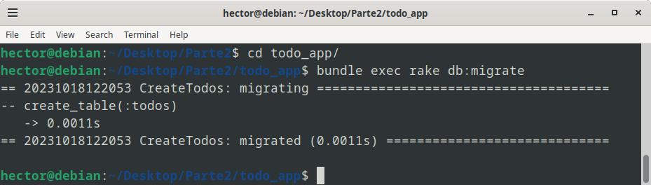

Tambien podemos agregar valores mediante seeding:

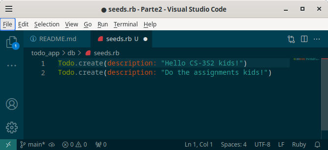

Y podemos confirmar que se han adicionado los datos que queriamos utilizando la consola de Rails.

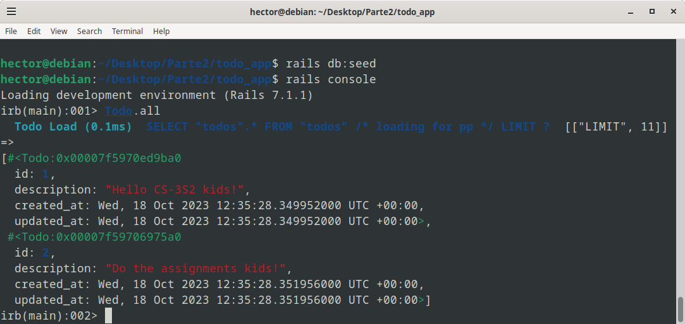

Ahora, queremos añadir una nueva columna para que cada ToDo tenga una fecha de vencimiento. Para esto creamos una nueva migracion:

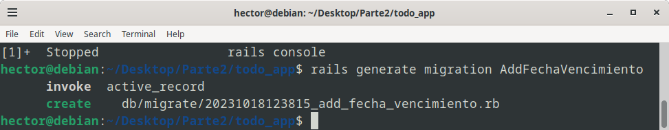

Y editamos esta migracion para que añada una columna "fechaVencimiento", con el tipo de dato "date" a la base de datos del recurso "todo".

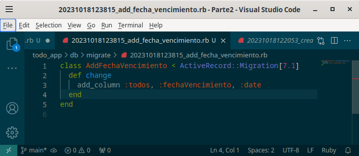

Despues de realizar la migracion con **rails db:migrate** podemos observar en la consola de Rails que se realizo satisfactoriamente: ahora tenemos una nueva columna fechaVencimiento con valores **nil**

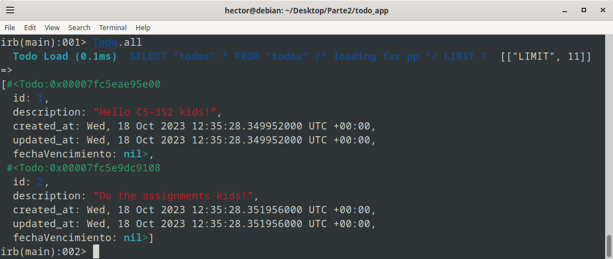

Observamos tambien que el contenido del archivo **schema.rb** se ha modificado de acorde:

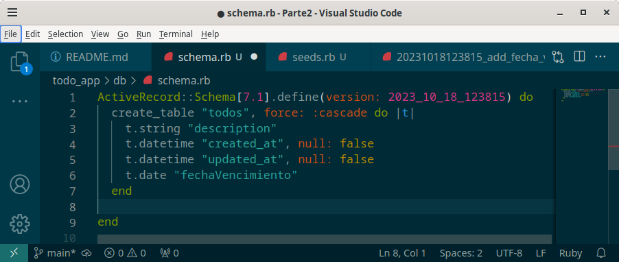

Luego, agregamos una ruta '/hello' a la que asignaremos la accion 'hello' del controlados de 'todos'.

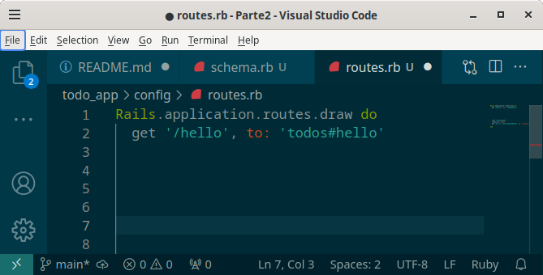

Luego modificamos el archivo **todos_controller.rb** para agragarle un metodo **hello** que renderice una vista **hello**, previamente definida en **app/views/todos**

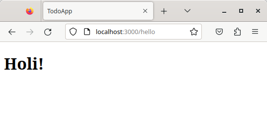

Ahora, queremos agregarle un nuevo atributo al modelo **todo**, un booleano que nos indique si una tarea ya fue realizada o no. Generamos una nueva migracion para adicionar esta columna: 

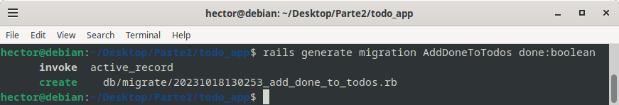

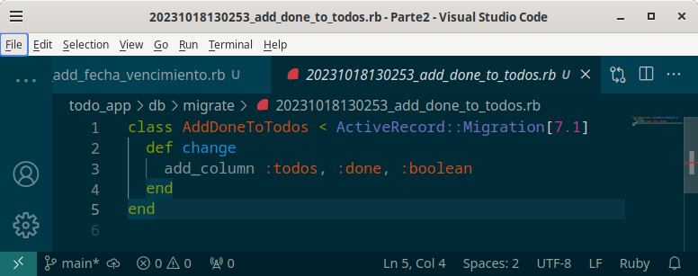

Verificamos que se adiciono la columna satisfactoriamente:

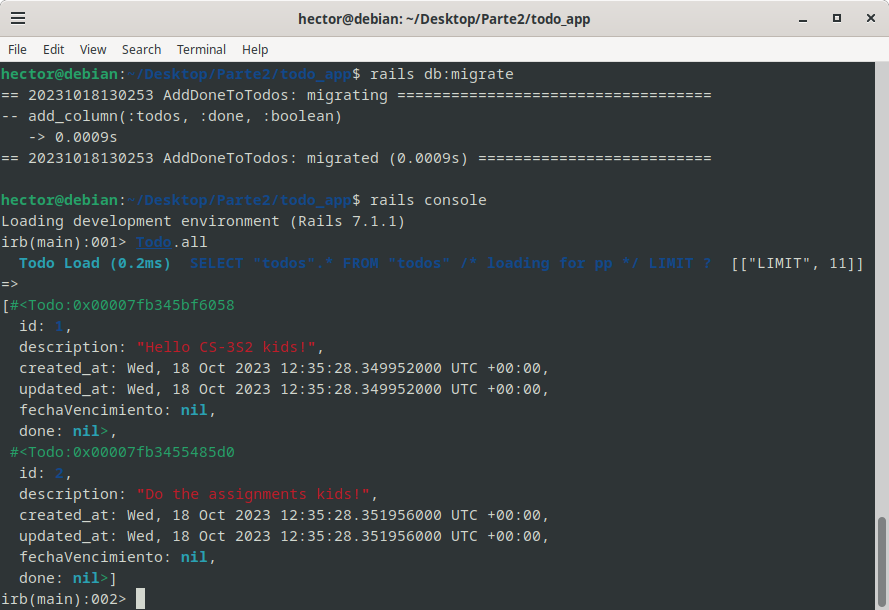

Para tener una ruta new_todo que nos direccione a una pagina para crear un nuevo item Todo no es necesario realizar algun cambio, pues al utilizar **generate scaffold**, por defecto se ha agregado al archivo de rutas de rails la expresion **resources :todos**, que nos proporciona las rutas CRUD por defecto de rails. Podemos verificar esto con el comando **rails routes**

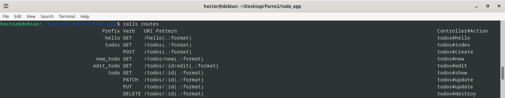

Si queremos que nuestra pagina inicial sea **todos#index** solo tenemos que agregar la expresion **root 'todos#index'** en el archivo de rutas.

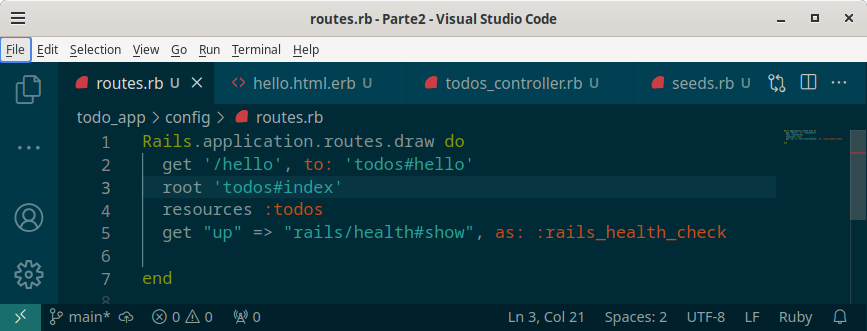

Verificamos que en efecto la pagina inicial sea la indicada:

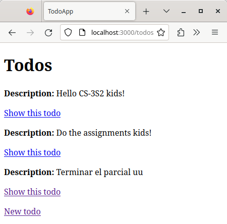

Hasta ahora hemos realizado dos migraciones: para agregar la columna fechaVencimiento, y para agregar la columna done. Podemos retroceder a la version anterior de la base de datos deshaciendo la migracion, con el comando **rails db:rollback**.

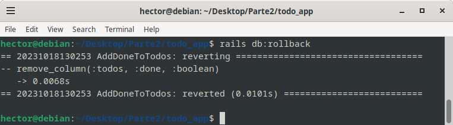

