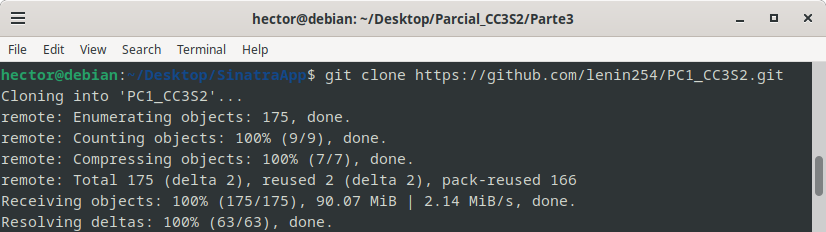

# Ruby on Rails

Para esta actividad se clono el repositorio entregado para la PC1 desde el repositorio de uno de los integrantes de mi grupo.

Pregunta:

**Cual es el objetivo de ejecutar bundle install?**
El objetivo es instalar las gemas definidas en el Gemfile y sus dependencias.

**Por qué es una buena práctica especificar –without production al ejecutarlo en su computadora de desarrollo?**
Para no instalar gemas innecesarias en el entorno de desarrollo, o alguna gema que pueda interferir con el comportamiento de otras usadas solo en el ambiente de desarrollo.

**¿En qué parte de la estructura del directorio de la aplicación Rails está el código correspondiente al modelo WordGuesserGame?**
El codigo correspondiente al modelo WordGuesserGame en la aplicacion Rails esta definido en 'app/models/word_guesser_game.rb'

**¿En qué archivo está el código que más se corresponde con la lógica del archivo app.rb de las aplicaciones Sinatra que maneja las acciones entrantes del usuario?**
La logica del archivo app.rb de Sinatra es bastante parecida a la logica del controlador de juego de Rails, que se encuentra en app/controllers/game_controller.rb. Aca se contiene la logica que determina si hay una adivinanza correcta, las redirecciones respectivas a las vistas, etc.

**¿Qué clase contiene ese código?**
Lo contiene la clase GameController.

**¿De qué otra clase (que es parte del framework Rails) hereda esa clase?**
La clase GameController hereda de la clase ApplicationController, que es parte del framework Rails y de la cual heredan todos los controladores que generemos en Rails.

**¿En qué directorio está el código correspondiente a las vistas de la aplicación Sinatra (new.erb, show.erb, etc.)?**
Las vistas en rails estan almacenadas en 'app/views/game'. Aqui encontramos las vistas correspondientes a las acciones del controlador **win, lose, new, show**.

**Los sufijos de nombre de archivo para estas vistas son diferentes en Rails que en la aplicación Sinatra. ¿Qué información proporciona el sufijo situado más a la derecha del nombre del archivo (por ejemplo: en foobar.abc.xyz, el sufijo .xyz) sobre el contenido del archivo?**
En Rails los archivos de vista tienen la forma 'abc.html.erb'. La extension .erb significa "Ruby embebido", es decir, codigo Ruby incrustado en un archivo HTML que se ejecuta al momento de presentar una de estas vistas.

**¿En qué archivo está la información de la aplicación Rails que asigna rutas (por ejemplo, GET/new) a las acciones del controlador?**
En rails, estas rutas estan definidas en '/config/routes.rb'. 

**¿Cuál es el papel de la opción :as => 'name' en las declaraciones de ruta de config/routes.rb?**
Este parametro nos permite dar mayor legibilidad a las rutas, para ser facilmente reutilizables en otras partes del proyecto (en los controladores al momento de hacer redirecciones, por ejemplo). Este es el caso de las expresiones **win_game_path, lose_game_path, etc** que encontramos en el controlador de game_controller.

**En la versión de Sinatra, los bloques before do...end y after do...end se utilizan para la gestión de sesiones. ¿Cuál es el equivalente más cercano en esta aplicación Rails y en qué archivo encontramos el código que lo hace?**
En GameController podemos observar las expresiones 'before_action :get_game_from_session' y 'after_action :store_game_in_session'. Estas son funciones definidas tambien en GameController, que cargan y guardan los datos de la sesion antes y despues de realizar una accion respectivamente. Esto lo realizan usando un arreglo session[] y los comandos YAML.load y .to_yaml para cargar y guardar respectivamente.

**En la versión de Sinatra, cada acción del controlador termina con redirect (que, como puedes ver, se convierte en redirección_to en Rails) para redirigir al jugador a otra acción, o con erb para representar una vista. ¿Por qué no hay llamadas explícitas correspondientes a erb en la versión Rails?**
Rails automaticamente renderizara la vista con el nombre de la accion realizada por el controlador salvo se especifique una redireccion a otra accion, con su propia vista. 

**En la versión de Sinatra, las vistas de show, win y lose reutilizan el código en la vista new que ofrece un botón para iniciar un nuevo juego. ¿Qué mecanismo de Rails permite reutilizar esas vistas en la versión de Rails?.**
En las vistas para **win** y **lose** se usa render :template => 'game/new'. Este es el mecanismo de rails para reutilizar otras vistas (en este caso, la vista new) a los que se quiera agregar algo. Existen tambien **vistas parciales**, que no estan asociadas a una accion de controlador en especifico, pero pueden ser usadas para la vista de una o mas acciones del controlador.
 
